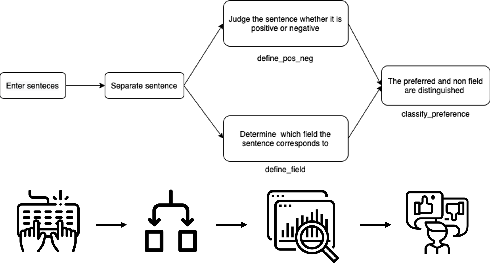

# NLP-Processor
Graduation Project of Gachon University Software Department

## Team members
| Std No. | Name | Department | E-mail | Github |
|:-------:|:----:|:-------:|:-------:|:-------:|
|201835417|김동준|AI·소프트웨어학부(소프트웨어전공)|rlaehdwns99@gachon.ac.kr|[Kim-Dong-Jun99](https://github.com/Kim-Dong-Jun99)|
|201835443|김현종|AI·소프트웨어학부(소프트웨어전공)|guswhd5738@gachon.ac.kr|[DecisionDisorder](https://github.com/DecisionDisorder)|
|201835474|안해빈|AI·소프트웨어학부(소프트웨어전공)|gnh06280@gachon.ac.kr|[HaebinAHN](https://github.com/HaebinAHN)|
|201735863|이원재|AI·소프트웨어학부(소프트웨어전공)|dnjswo0213@gachon.ac.kr|[Wonjae98](https://github.com/Wonjae98)|
 

## Introduction
This is a Python program that determines which field the user is referring to and whether he or she prefers the field through the information entered at the time of membership.
1. The list of areas to be classified is as follows: AI, android, backend, frontend, bigdataengineer,blockchain, dataengineer, datascience, deeplearning, gameclient, gameserver, machinelearning
2. Determine whether the sentences are positive or negative, and store them in the List in the order of the input sentences and return them.
3. Whether each sentence is positive or negative and the field is determined and stored in order.

# Used API
KoNLPy: KoNLPy is a Python package for processing Korean information.
Opt: Opensource Korean Text Processor. This is a simple morpheme parser that can quickly process spaced sentences. The execution speed is the fastest among morpheme parsers.

# Structure

